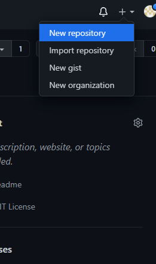

# Tugas MDPL Praktik
<h2> Daftar isi : </h2>


1. [Install GIT](https://github.com/erwinstw/erwinstw-01-git-github#-instalasi-git-di-windows)
2. [Konfigurasi GIT]()
3. [Mengelola Repositori]()
* [Mengelola repositori di akun sendiri]()
* [Mengelola repositori di organisasi]()

<h2> Instalasi Git di Windows</h2>

Setelah download Git, double click pada file yang di-download. Akan dimunculkan lisensi. Klik Next untuk lanjut.


Setelah itu, pilih lokasi instalasi. Secara default akan terisi C:\Program Files\Git. Ganti lokasi jika memang anda menginginkan lokasi lain, klik Next


Pilih komponen. Tidak perlu diubah-ubah, sesuai dengan default saja. Klik pada Next.


Mengisi shortcut untuk menu Start. Gunakan default (Git), ganti jika ingin mengganti - misalnya Git VCS.


Pilih editor yang akan digunakan bersama dengan Git. Pada pilihan ini, digunakan Notepad++.


Pilih Let Git decide. 


Pilih Git from command line and also from 3rd-party software


Pilih pilihan pertama


Pilih OpenSSL untuk HTTPS. Git menggunakan https untuk akes ke repo GitHub atau repo-repo lain (GitLab, Assembla).


Pilih pilihan pertama untuk konversi akhir baris (CR-LF).


Untuk opsi ekstra, pilih serta aktifkan 1 dan 2.


Kemudian klik Install


Setelah itu proses instalasi akan dilakukan.


Jika selesai akan muncul dialog pemberitahuan. Klik pada Finish.


Untuk menjalankan, dari Start menu, ketikkan "Git", akan muncul beberapa pilihan. Pilih "Git Bash" atau "Git GUI".


Tampilan jika akan menggunakan "Git Bash"


Tampilan jika akan menggunakan "Git GUI"


Untuk mencoba dari command prompt, masuk ke command prompt, setelah itu eksekusi "git --version" untuk melihat apakah sudah terinstall atau belum. Jika sudah terinstall dengan benar, makan akan muncul hasil berikut:


# Konfigurasi GIT

Sebelum mengguanakan git sebaiknya melakukan 2 konfigurasi username dan email, dengan menggunakan perintah berikut ini :


```
$ git config --global user.name "username"
$ git config --global user.email emailkamu@domain.tld
```


Pastikan username dan email untuk memasukkan username dan email yang sama dengan github yang digunakan.dan gunakan perintah dibawah ini untuk melihat configurasinya.

# Mengelola Repositori
Personal access token
Mulai 13 Agustus 2021, penggunakan token merupakan hal wajib ubtuk semua akses ke github yang memerlukan otentikasi. Sehingga perlu membuat personal access token. dapat melihat pada link berikut : https://docs.github.com/en/authentication/keeping-your-account-and-data-secure/creating-a-personal-access-token

## Mengelola repositori di akun sendiri

### Membuat Repository

Langkah pertama yang dilakukkan adalah membuat repositori baru klik tanda + dibagian pojok kanan atas, lalu pilih New repository.



isikan nama repositori, deskripsi (opsional), dan lisensi (bila diperlukan), dan repositori dapat dibuat public maupun private.


klik tombol Create repository

Clone Repository
Clone repositori adalah cara ubtuk menduplikasi ropositori kita yang berada digithub ke komputer lokal. caranya dengan menggunakan perintah berikut ini $ git clone https://alamatrepo.git.


Setelah melakukan clone di komputer lokal kita dapat melakukan perubahan maupun penambahan yang nantinya dapat dipush ke github.


Mengubah - Push tanpa branching dan merging
perubahan terjadi karena :

Ada file atau direktori yang dihapus
Isi File berubah, atau file diedit
Ada File atau direktori baru


Ketika menabahkan file README.md dan memasukan text otomatis telah terjadi perubahan kita perlu untuk melakukan perintah $ git add -A untuk memasukan file mana saja yang akan dicommit, setelah itu kita perlu melakukan commit dengan perintah ``$ git commit -m`` "pesan" barulah melakukan push dengan perintah $ git push origin branch.

Mengubah isi dengan branching dan merging
Dengan cara ini ketika akan melakukan perubahan, perubajhan itu dilakukan di komuter lokal dengan membuat branch yang nantinya akan digunakan untuk menampung perubahan - perubahan. Dan nantinya branch itu akan di merge dengan branch utama biasanya bernama master atau main.


# Sinkronisasi
Bila kita melakukkan perubahan di komputer lain kita perlu melakukkan sinkronisasi pada komputer lainnya. Dengan perintah berikut :
```
$ git pull
```
Membatalkan Perubahan


# Mengelola repositori di organisasi

Repositori dapat kita buat diakun kita maupun berada di organisasi. Organisasi dapat kita buat sendiri juga bila dimasukkan menjadi anggota organisasi. Perbedaan pada saat membuat diakun sendiri adalah pada bagian Owner, Owner dari repositori yang kita buat adalah organisasi.


